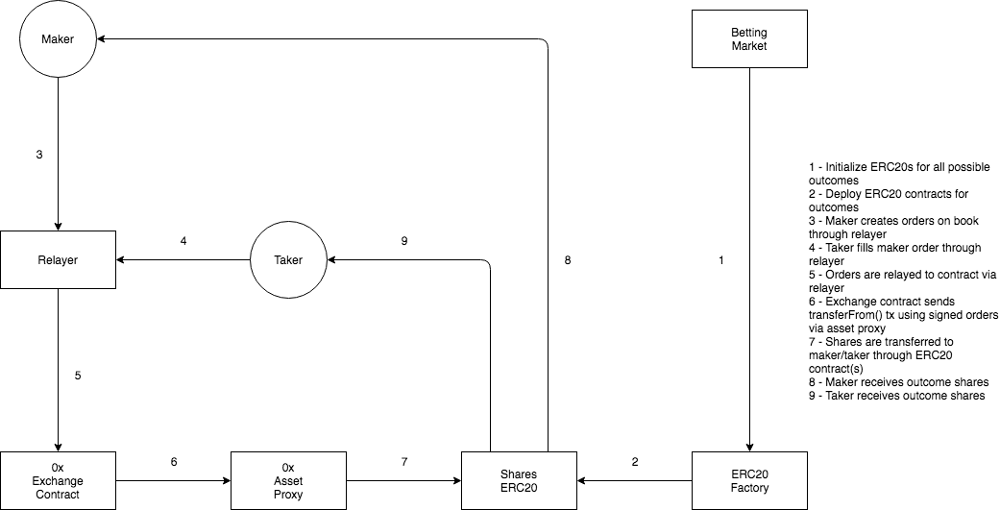
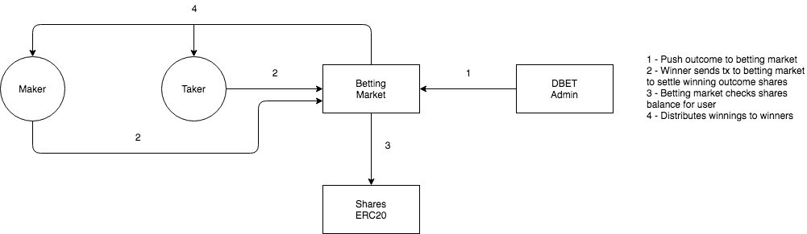

# Decent.bet prediction market contract architecture

The Decent.bet prediction market contracts make use of the [0x protocol](#https://0xproject.com)
for off-chain order relaying and on-chain order settlement for betting markets created
on the DBET betting exchange smart contracts.

The Decent.bet betting market and exchange works similar to [**Augur**](https://www.augur.net), 
except instead of decentralizing outcome reporting - it relies on Decent.bet oracles to push outcomes to 
active betting markets.

## Architecture overview


### Creating and filling bets



### Outcome and order settlement



## 0x protocol usage (Order creation/cancellation/filling)

The DBET prediction markets make use of the 0x protocol as-is without any modifications at
the protocol level. It instead leverages wrapper contracts to enforce desired functionality
necessary to run a betting exchange.

Order creation **and** cancellation happens off-chain through relayers. Unlike the 0x 
model which requires on-chain cancellations of published order hashes, in the DBET
prediction market implementation - it requires signatures for each order from the relayers as well 
(see [Relayers and white-labelling](#relayers-and-white-labelling))

Order fills are the only action happening on-chain and it's done using the **BettingExchange** contract, 
which is a wrapper contract used to fill orders on the deployed 0x **Exchange** contract.

The `fillOrder()` function in **BettingExchange** mints long/short shares based on the order passed 
within the function parameters.

The function parameters passed to `fillOrder()` are as follows:

```
/// @dev Fills an order using `msg.sender` as the taker.
/// @param marketId ID of betting market
/// @param outcome Outcome being bet on
/// @param isLong is order filling a long or short position
/// @param order Order struct containing order specifications.
/// @param takerAssetFillAmount Desired amount of takerAsset to sell.
/// @param salt Arbitrary value to guarantee uniqueness of 0x transaction hash.
/// @param orderSignature Proof that order has been created by maker.
/// @param takerSignature Proof that taker wishes to call this function with given params.
/// @return bool Whether order fill was successful
function fillOrder(
    bytes32 marketId,
    bytes32 outcome,
    bool isLong,
    LibOrder.Order memory order,
    uint256 takerAssetFillAmount,
    uint256 salt,
    bytes memory orderSignature,
    bytes memory takerSignature
)
```

For example, in the scenario of a bid of 0.1 for 100 longs of outcome A by the maker, 
the full sequence of code execution within `fillOrder()` in **BettingExchange** would be 
as follows:

1. Contract would check whether the following conditions are satisfied:
    * The market exists.
    * If the `marketClose` time hasn't passed.
    * If the outcome is valid - based on outcomes pushed to the betting market.
1. `order.makerAssetAmount` would be set at 10 DBETs, `takerAssetFillAmount` would be set at 100 long outcome share tokens.
1. Contract would check whether maker has and has approved `order.makerAssetAmount` (10) DBETs.
1. Contract would then check whether taker has `takerAssetFillAmount - order.makerAssetAmount` 
   and has approved `takerAssetFillAmount` DBETs, which would mean the taker would need a 
   minimum balance of (100 - 10) DBETs or 90 DBETs and allowance of 100 DBETs.
1. Contract would mint `takerAssetFillAmount` (100) long share tokens (assuming maker is long) for the taker.
1. Contract would execute the 0x transaction for 100 longs and 10 DBETs between maker and taker.
   Maker would now have 100 longs and taker would have 10 DBETs resulting in a total of 100 transferable DBETs.
1. Contract would transfer `takerAssetFillAmount` (100) DBETs from taker to contract - which acts as an escrow until
   the bet outcome is published and the market is settled.
1. Contract would mint `takerAssetFillAmount` short share tokens (assuming maker is long) for the taker
1. Maker would have 100 long share tokens, taker would have 100 short share tokens and contract would have 100 DBETs escrow-ed
   until the bet outcome is published and market is settled.

## Market resolution

Active markets can be resolved after the event has ended by a DBET admin. Admins are required to push a valid winning 
outcome for a market to be considered resolved.

## Redeem winning shares

After a market has been resolved, bettors would be able to redeem favorable outcome token shares, i.e longs on a correct outcome or
shorts on incorrect outcomes for their initial capital + a split of the total amount of DBETs bet on unfavorable outcomes.

For example, in a market having two possible outcomes `A` and `B` and two participants `t1` and `t2`.
If there are 100 longs for `A` at 0.1 DBETs per long for `t1` (10 DBETs wagered by `t1` and 90 DBETs wagered by `t2`) 
and 100 longs for `B` at 0.6 DBETs per long for `t2` (60 DBETs wagered by the `t2` and 40 DBETs wagered by `t1`)

The total DBETs wagered would be 200 DBETs. If `A` wins, `t1` would receive 200 DBETs in total for a total wager of 70 DBETs. 
If `B` wins, `t2` would receive 200 DBETs for a total wager of 130 DBETs.

## Relayers and white-labelling

Relayers are pretty much 0x relayers which host signed ERC20 token orders off-chain except in this context they are meant 
for markets and their outcomes long/short token pairs. 

Relayer servers in DBET add on to the 0x relayer functionality with order signing by the relayers and order cancellation.
This allows for order cancellations to be done off-chain by requiring a relayer signature for orders as well when being
submitted to the `BettingExchange` contract. If an orderHash isn't available within a relayer, the order
will not be signed by the relayer and not fillable on-chain.

This also allows for white label partners by adding permissioned relayers on contract allowing
only these permissioned addresses to sign orders allowing them to fill on `BettingExchange`.

## Fees

Fees for each order are structured the same as the 0x protocol, except instead of the native ZRX token, DBETs are used for fees to be paid to relayers.
The fees here - `makerFee` and `takerFee` are to be set by the relayer and are returned using the `/order_config` endpoint 
along with the relayer's `feeRecipientAddress` which would receive the fees.

This however requires users of the relayer to approve the `Exchange` address to transfer
tokens to the relayer's `feeRecipientAddress`. This can be simplified on Vechain by making use
of transaction clauses and sending transaction data for both `approve` and `fillOrder` in
a single transaction.